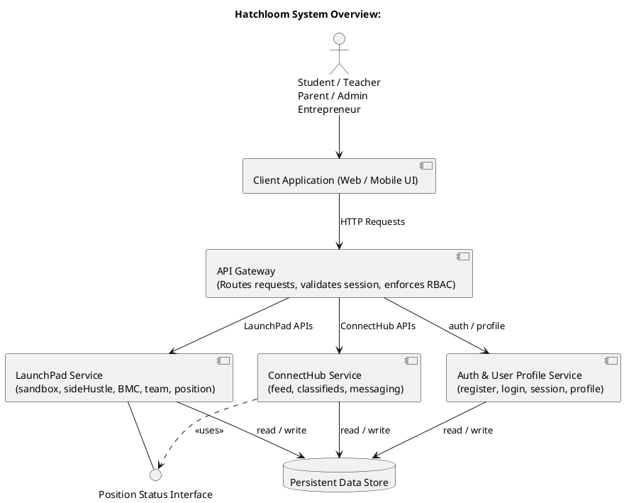
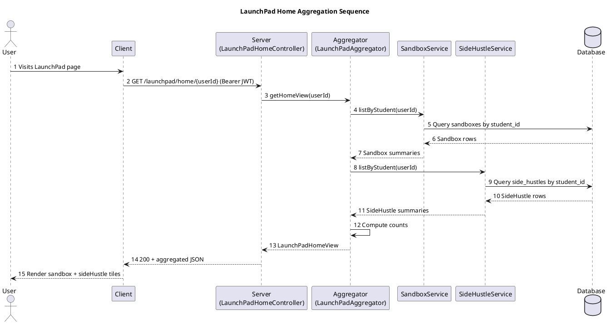

# Hatchloom Frontend — LaunchPad UI

The frontend is a single-page application serving the **LaunchPad** sub-product of the Hatchloom platform. It lets students manage Sandboxes (idea workspaces), SideHustles (real ventures), and the tools, teams, and business model canvases that belong to them.

---

## Table of Contents

1. [Key Design Choices](#1-key-design-choices)
2. [System Context](#2-system-context)
3. [Architecture Overview](#3-architecture-overview)
4. [Directory Structure](#4-directory-structure)
5. [Routing](#5-routing)
6. [Component Architecture](#6-component-architecture)
7. [Data Flow](#7-data-flow)
8. [State Management](#8-state-management)
9. [API Integration](#9-api-integration)
10. [Theming & Styling](#10-theming--styling)
11. [Running Locally](#11-running-locally)
12. [Docker & Deployment](#12-docker--deployment)

---

## 1. Key Design Choices

### React 19 + Vite + TypeScript

React 19 with the new React Compiler is used. The compiler handles memoisation automatically, removing the need for manual `useMemo` / `useCallback`. Vite provides near-instant HMR and a fast production build pipeline. TypeScript is set to strict mode throughout.

### React Query (TanStack Query v5) for server state

All data fetched from the backend lives in React Query's cache — not in component state or a global store. This gives automatic background refresh, loading/error states, and cache invalidation on mutation with zero boilerplate. There is no Redux or Zustand; the server and UI state layers are cleanly separated.

### React Router v7

File-based-style route declarations in a single `App.tsx`. The ToolPage uses an overlay pattern (renders on top of the Sandbox detail) rather than a true modal, which allows direct deep-linking to any tool.

### shadcn/ui (unstyled components) + Tailwind CSS v4

shadcn/ui provides accessible, unstyled primitive components (Dialog, Select, Tooltip, etc.) that are owned directly in `src/components/ui/`. Tailwind CSS v4 (via the Vite plugin) handles all styling. There is no `tailwind.config.js` — configuration lives entirely in `index.css` via CSS custom properties and `@theme`.

### Feature-co-located components

Components are not split by type (atoms/molecules/organisms) but by **feature**. All sandbox-detail UI lives in `components/launchpad/sandbox-detail/`, all tool-page UI in `components/launchpad/tool-page/`, etc. This keeps related code together and avoids cross-feature coupling.

### Custom hooks as the data boundary

Every page talks to the server exclusively through a custom hook (`useSandbox`, `useSideHustle`, `useLaunchPadHome`, etc.). Pages are not allowed to call `apiFetch` directly. This creates a clear and testable boundary between UI and data-fetching logic.

---

## 2. System Context

The frontend sits at the outermost layer of the Hatchloom system. It communicates only with the **LaunchPad backend service**. Authentication tokens are expected to be stored in `localStorage` and are forwarded as `Bearer` headers on every API call. The Auth service is external and not managed by this codebase.



> Source: [`../diagrams/component_overview.puml`](../diagrams/component_overview.puml)

---

## 3. Architecture Overview

The frontend follows a layered architecture. Data flows strictly downward: the backend API → `apiFetch` → custom query hooks → page components → feature components.

```text
┌─────────────────────────────────────────────────────────┐
│                        Browser                          │
│                                                         │
│  ┌──────────┐   ┌──────────┐   ┌─────────────────────┐ │
│  │  Router  │──▶│  Pages   │──▶│  Feature Components  │ │
│  └──────────┘   └────┬─────┘   └─────────────────────┘ │
│                      │                                  │
│              ┌───────▼────────┐                         │
│              │  Custom Hooks  │  ← React Query cache    │
│              └───────┬────────┘                         │
│                      │                                  │
│              ┌───────▼────────┐                         │
│              │   apiFetch()   │  ← auth token injected  │
│              └───────┬────────┘                         │
└──────────────────────┼──────────────────────────────────┘
                       │ HTTP (JSON)
              ┌────────▼────────┐
              │  LaunchPad API  │
              │   :8082         │
              └─────────────────┘
```

---

## 4. Directory Structure

```text
frontend/src/
├── App.tsx                          # Route declarations
├── main.tsx                         # React root + QueryClient + ThemeProvider
├── index.css                        # Tailwind + CSS custom properties + keyframes
│
├── pages/                           # One file per route
│   ├── StudentHome.tsx              # / — landing page
│   ├── LaunchPadHome.tsx            # /launchpad — overview
│   ├── SandboxDetail.tsx            # /launchpad/sandboxes/:sandboxId
│   ├── SideHustleDetail.tsx         # /launchpad/sidehustles/:sideHustleId
│   └── ToolPage.tsx                 # /launchpad/sandboxes/:sandboxId/tools/:toolType
│
├── components/
│   ├── ui/                          # shadcn/ui primitives (owned, not node_modules)
│   ├── layout/
│   │   ├── AppLayout.tsx            # Sidebar + TopNav shell
│   │   ├── Sidebar.tsx              # Left nav with badge support
│   │   └── TopNav.tsx               # XP, rank, streak, notifications
│   ├── launchpad/
│   │   ├── navigation.ts            # Sidebar section config for LaunchPad
│   │   ├── home/
│   │   │   ├── home-cards.tsx       # SandboxTile, SideHustleTile, StatusBar
│   │   │   └── create-dialogs.tsx   # Create Sandbox / SideHustle modals
│   │   ├── sandbox-detail/
│   │   │   ├── tool-sections.tsx    # ActiveToolsCard, AddToolDialog
│   │   │   ├── hero-card.tsx        # Title/description with edit/delete
│   │   │   ├── main-sections.tsx    # Re-exports for SandboxDetail page
│   │   │   ├── panel-cards.tsx      # TodoCard, CommsCard, ResourceCard, ShelfRow
│   │   │   ├── edit-sandbox-dialog.tsx
│   │   │   └── demo-data.ts         # Static shelf/channel data
│   │   ├── sidehustle-detail/
│   │   │   ├── hero-card.tsx        # Title + team avatars + status badge
│   │   │   ├── management-sections.tsx # BMCSection, PositionsSection, AddTeamMemberDialog
│   │   │   ├── panel-cards.tsx
│   │   │   ├── business-cards.tsx
│   │   │   ├── interaction-cards.tsx
│   │   │   ├── shelf-cards.tsx
│   │   │   └── demo-data.ts
│   │   └── tool-page/
│   │       ├── shared.tsx           # ToolIcon, Toast, ActionBtn, ABSep, SaveState type
│   │       ├── tool-contents.tsx    # Dispatches to specific tool renderer
│   │       ├── postit-content.tsx   # Note journal tool
│   │       ├── checklist-content.tsx
│   │       ├── guided-qa-content.tsx
│   │       ├── deck-content.tsx     # Slide deck editor
│   │       └── coming-soon-content.tsx
│   ├── student-home/
│   │   └── constants.ts             # Nav sections, badges, banners for StudentHome
│   └── theme-provider.tsx           # Light/dark context + localStorage + system detect
│
├── hooks/
│   ├── use-student.ts               # Student profile (mocked, staleTime: Infinity)
│   ├── use-launchpad-home.ts        # GET /launchpad/home/{studentId}
│   ├── use-sandbox.ts               # GET sandbox + tools (parallel queries)
│   ├── use-side-hustle.ts           # GET sideHustle + BMC + team + positions (parallel)
│   └── use-mutations.ts             # All 14 CRUD mutations
│
└── lib/
    ├── types.ts                     # All TypeScript types (mirrors backend DTOs)
    ├── api-client.ts                # apiFetch wrapper (auth token injection)
    ├── mock-data.ts                 # MOCK_STUDENT, TOOL_META, RANK_META, demo data
    └── utils.ts                     # cn() Tailwind class merge helper
```

---

## 5. Routing

Five routes are declared in [`App.tsx`](src/App.tsx) using React Router v7's `BrowserRouter`:

| Path | Component | Description |
| ---- | --------- | ----------- |
| `/` | `StudentHome` | Landing page — XP, rank, banners, activity |
| `/launchpad` | `LaunchPadHome` | Sandbox + SideHustle tiles, tool discovery |
| `/launchpad/sandboxes/:sandboxId` | `SandboxDetail` | Full sandbox workspace |
| `/launchpad/sidehustles/:sideHustleId` | `SideHustleDetail` | Venture management |
| `/launchpad/sandboxes/:sandboxId/tools/:toolType` | `ToolPage` | Full-screen tool editor overlay |

`ToolPage` is rendered as an animated overlay panel (fixed inset, dark backdrop) on top of `SandboxDetail`. Navigating to a tool URL deep-links directly into the editor without needing to visit the sandbox first.

---

## 6. Component Architecture

### Layout shell

Every page is wrapped in `AppLayout`, which composes `TopNav` and `Sidebar`. The sidebar receives its section configuration as props (each feature area exports its own `SIDEBAR_SECTIONS` constant). This makes the layout reusable across LaunchPad, ConnectHub, and future sub-products.

```text
AppLayout
├── TopNav          (student badge, XP, streak, notifications)
└── Sidebar         (dynamic sections + CTA button)
    └── <page content slot>
```

### Tool rendering pipeline

The ToolPage delegates rendering to `ToolContent`, which dispatches by `toolType` string:

```text
ToolPage
└── ToolContent (tool-contents.tsx)
    ├── "POSTIT"      → PostItContent
    ├── "CHECKLIST"   → ChecklistContent
    ├── "GUIDED_QA"   → GuidedQAContent
    ├── "DECK"        → DeckContent
    └── *             → ComingSoonContent
```

Each tool content component:

- Receives the raw `SandboxTool` entity (with `data: string | null` — a JSON blob)
- Parses `data` safely with `try/catch` fallback to a clean default state
- Calls `onUnsaved(serialisedData)` on every edit, which triggers a 2-second debounced auto-save in `ToolPage`

### Sandbox detail layout zones

```text
SandboxDetail
├── Zone 1 — Hero: HeroCard (title, description, edit/delete)
├── Quick Actions bar (Add Note, Add Todo, Set Milestone, Add Resource, Share)
├── Zone 2 — Working Wall
│   ├── ActiveToolsCard  (tool grid → links to ToolPage)
│   ├── TodoCard
│   └── CommsCard
└── Zone 3 — Shelf (horizontal scroll rows)
    ├── Tagged Resources
    ├── Active Channels
    └── Recommended for this Project
```

---

## 7. Data Flow

### Home page load sequence



> Source: [`../diagrams/sequence_home.puml`](../diagrams/sequence_home.puml)

### Tool auto-save flow

```text
User types in tool editor
        │
        ▼
onUnsaved(data) called
        │
        ├─ setSaveState("unsaved")
        ├─ pendingDataRef.current = data   ← ref, not state (no re-render)
        └─ clearTimeout(saveTimer); saveTimer = setTimeout(doSave, 2000)
                │
                ▼ (after 2s of inactivity)
           doSave()
                │
                ├─ setSaveState("saving")
                ├─ PUT /launchpad/sandboxes/:id/tools/:toolId
                │       { data: pendingDataRef.current }
                └─ on success: setSaveState("saved"), showToast("💾 Saved")
```

A `useRef` holds the latest pending data so the debounced `doSave` always reads the most recent value without needing to be re-created on every keystroke.

### Parallel data fetch (Sandbox Detail)

`useSandbox` fires two queries in parallel via React Query — the sandbox metadata and its tool list — and combines them into a single return value. The page skeletons until both resolve.

```typescript
// hooks/use-sandbox.ts
const sandboxQuery  = useQuery(["sandbox", sandboxId], ...)
const toolsQuery    = useQuery(["sandbox-tools", sandboxId], ...)

return {
  sandbox:   sandboxQuery.data ?? null,
  tools:     toolsQuery.data ?? [],
  isLoading: sandboxQuery.isLoading || toolsQuery.isLoading,
}
```

`useSideHustle` fires four parallel queries: the venture, its BMC, team members, and positions.

---

## 8. State Management

| State type | Where it lives | Why |
| ---------- | -------------- | --- |
| Server data (sandboxes, tools, BMC…) | React Query cache | Automatic invalidation, background refresh |
| Tool editing (unsaved content) | `useRef` + `useState` in `ToolPage` | Ref for debounced saves; state for save indicator |
| Dialog open/close | `useState` in the page that owns the dialog | Local, no need to hoist |
| Theme (light/dark) | React Context (`ThemeProvider`) | Needs to span the full component tree |
| Student profile | React Query (mocked, `staleTime: Infinity`) | Will be replaced by Auth service call |

There is no global state library. The query cache acts as the single source of truth for all server data. All mutations invalidate the relevant query keys on success, so the UI stays in sync automatically.

---

## 9. API Integration

### `apiFetch` — the only HTTP boundary

```typescript
// lib/api-client.ts
const BASE_URL = import.meta.env.VITE_API_BASE_URL ?? "http://localhost:8082"

async function apiFetch<T>(path: string, options?: RequestInit): Promise<T> {
  const token = localStorage.getItem("auth_token")
  const res = await fetch(BASE_URL + path, {
    ...options,
    headers: {
      "Content-Type": "application/json",
      ...(token ? { Authorization: `Bearer ${token}` } : {}),
      ...options?.headers,
    },
  })
  if (!res.ok) throw new Error(`${res.status} ${res.statusText}`)
  return res.json() as Promise<T>
}
```

### Query hooks

| Hook | Endpoint(s) | Query key |
| ---- | ----------- | --------- |
| `useStudent()` | mocked | `["student"]` |
| `useLaunchPadHome(studentId)` | `GET /launchpad/home/{studentId}` | `["launchpad-home", studentId]` |
| `useSandbox(sandboxId)` | `GET /launchpad/sandboxes/{id}` + tools | `["sandbox", id]`, `["sandbox-tools", id]` |
| `useSideHustle(sideHustleId)` | sideHustle + BMC + team + positions | `["sidehustle", id]`, `["bmc", id]`, `["team", id]`, `["positions", id]` |

### Mutation hooks (all in `use-mutations.ts`)

| Hook | Method + Path | Invalidates |
| ---- | ------------- | ----------- |
| `useCreateSandbox()` | `POST /launchpad/sandboxes` | `["launchpad-home", studentId]` |
| `useUpdateSandbox(id)` | `PUT /launchpad/sandboxes/{id}` | `["sandbox", id]` |
| `useDeleteSandbox()` | `DELETE /launchpad/sandboxes/{id}` | `["launchpad-home"]`, removes sandbox + tools keys |
| `useAddTool(sandboxId)` | `POST /launchpad/sandboxes/{id}/tools` | `["sandbox-tools", id]` |
| `useUpdateTool(sandboxId)` | `PUT /launchpad/sandboxes/{id}/tools/{toolId}` | `["sandbox-tools", id]` |
| `useDeleteTool(sandboxId)` | `DELETE /launchpad/sandboxes/{id}/tools/{toolId}` | `["sandbox-tools", id]` |
| `useCreateSideHustle()` | `POST /launchpad/sidehustles` | `["launchpad-home", studentId]` |
| `useUpdateSideHustle(id)` | `PUT /launchpad/sidehustles/{id}` | `["sidehustle", id]` |
| `useDeleteSideHustle()` | `DELETE /launchpad/sidehustles/{id}` | `["launchpad-home"]`, removes sidehustle key |
| `usePatchBMC(id)` | `PATCH /launchpad/sidehustles/{id}/bmc` | `["bmc", id]` |
| `useAddTeamMember(id)` | `POST /launchpad/sidehustles/{id}/team/members` | `["team", id]` |
| `useRemoveTeamMember(id)` | `DELETE /…/team/members/{memberId}` | `["team", id]` |
| `useCreatePosition(id)` | `POST /launchpad/sidehustles/{id}/positions` | `["positions", id]` |
| `useUpdatePositionStatus()` | `PUT /…/positions/{positionId}/status` | `["positions", sideHustleId]` |

---

## 10. Theming & Styling

### CSS custom properties

All design tokens are defined as CSS variables in `index.css` inside a `@theme` block:

```css
--hatch-pink:      oklch(0.55 0.26 15);   /* primary brand */
--hatch-orange:    oklch(0.65 0.19 45);   /* accent */
--hatch-charcoal:  oklch(0.17 0.02 270);  /* dark text */
--sandbox-green:   oklch(0.55 0.15 160);  /* sandbox highlight */
--sidehustle-amber: ...;
```

Rank tier colours, swimlane colours, and feature accents are all defined as named variables and consumed via Tailwind's `text-hatch-pink`, `bg-sandbox-green`, etc.

### Dark mode

`ThemeProvider` manages a `"light" | "dark" | "system"` preference:

- Persisted in `localStorage`
- System preference detected via `prefers-color-scheme` media query
- Synced across browser tabs via `storage` events
- Applied by toggling the `.dark` class on `<html>`

### Typography

- **Body:** DM Sans Variable (`font-body`)
- **Headings:** Outfit Variable (`font-heading`)

Both fonts are loaded via `@fontsource-variable` packages (self-hosted, no Google Fonts CDN).

---

## 11. Running Locally

**Prerequisites:** Node.js 22+

```bash
cd frontend
npm ci
npm run dev          # dev server at http://localhost:5173
```

The dev server proxies nothing — it expects the LaunchPad backend running at `http://localhost:8082` (set in `.env.local`).

```bash
# .env.local
VITE_API_BASE_URL=http://localhost:8082
```

Other scripts:

```bash
npm run typecheck    # tsc --noEmit
npm run lint         # ESLint
npm run format       # Prettier
npm run build        # type check + Vite build → dist/
npm run preview      # serve the built dist/
```

---

## 12. Docker & Deployment

The frontend uses a two-stage Docker build:

```dockerfile
# Stage 1 — build
FROM node:22-alpine AS builder
ARG VITE_API_BASE_URL=http://localhost:8082
ENV VITE_API_BASE_URL=$VITE_API_BASE_URL
RUN npm ci && npm run build

# Stage 2 — serve
FROM nginx:1.27-alpine
COPY nginx.conf /etc/nginx/conf.d/default.conf
COPY --from=builder /app/dist /usr/share/nginx/html
```

`VITE_API_BASE_URL` **must** be passed as a build argument — it is baked into the JavaScript bundle at build time by Vite. `.env*` files are excluded from the Docker build context by `.dockerignore`.

Nginx is configured with a React Router SPA fallback (`try_files $uri /index.html`) and long-lived cache headers for Vite's content-hashed `/assets/` files.

**Via docker compose (recommended for full stack):**

```bash
docker compose up --build
```

| Service | Host port | Notes |
| ------- | --------- | ----- |
| `frontend` | 4173 | nginx serving built SPA |
| `launchpad` | 8082 | Spring Boot backend |
| `postgres` | 5432 | PostgreSQL 16 |
